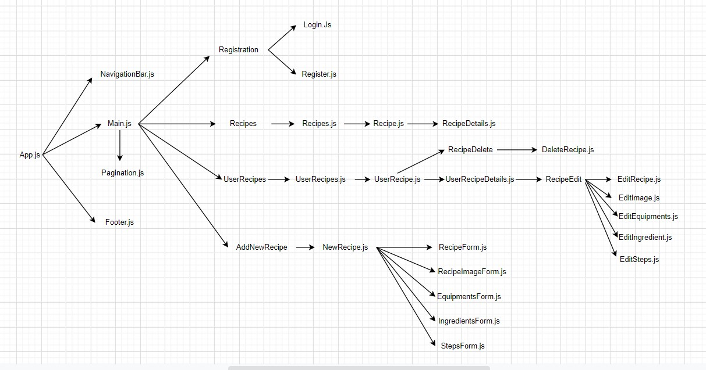

# Recipe Sharer View (React)

## Description

Recipe Sharer is a web application that allows a user to post and share one or more recipe/s with other users.

## Instruction

A guest user that is not registered and didn't login to the application can browse a list of recipes, and if clicks on a recipe displays the details of the recipe.

The application gives also the possibility to register and login, once a user is logged in will be redirected to his own space and has access for the different functionalities of the application.

The different functionalities are: a user can create a new recipe, by creating a new recipe is necessary to fill different forms, such as upload an image, equipment, ingredients and steps. Once these forms are filled automatically redirects to the details page of the recipe.

In the user space page, is possible to choose to delete or edit a recipe.

## Future Features Implementation
- I would like to implement an admin tools, where an admin can manage different accounts that are registered to the application.
- Giving the possibilities to other users to comment and like a recipe.
- When a user creates a new account sends an email verification by email to confirm it.
- Adding new element in the edit page. At the moment a user can only edit a recipe but can not add new items.
- Add a dropdown to help the user to select time and amount of an ingredient. At the moment a user can write by hand quantity and time, but I would like to minimise the error during the input. For example when asked amount for an ingredient, the dropdown gives the possibility to select if is in gram/s, piece/s, tablespoon/s, teaspoon/s etc. 

## Additional packages
- React bootstrap
- react-router-dom
- lodash
- react-icons

## Architecture Design Screenshot
In this diagram displays all the components and their relationship between each other that I have used to build this application. In the next section (Approach) there is an explanation more in details of it.

## Approach

In this part I would like to explain the diagram that is showed above and I have separated by CRUD functionality. 

#### Routing
In MainPage.js is where there is the Browser Router and redirects to the different pages. The pages that redirects are: Recipes.js, RecipeDetails.js, Login.js, Register.js, UserRecipes.js, UserRecipeDetails.js and NewRecipe.js But first I would like to explain from the App.js where retrieves a list of recipes and further displayed in Recipe.js.

#### Get
I have started first to fetch the url from the API that I have built to retrieve a list of recipes, once the state has been set I have passed as a props into MainPage.js and further into Recipes.js. In Recipes.js I have mapped the list and destructured each information into Recipe.js, where I have created a card to display the recipes. In MainPage.js I have set a Pagination.js to display only 5 recipes per page.

In Recipe.js I have created a link that gives the possibility to bring us to RecipeDetails.js page, where displays all the details of the page such as ingredients, equipment and steps. To create the link I have passed as a props from App.js a function that can get the Id of the recipe, where in App.js does a new Get request to retrieve the details of the single recipe.

The same thing I have done for UserRecipes.js. Once the current user has been logged in, in App.js I have fetched the url to get only the recipes of the current user, passed the list as a props in MainPage.js and finally to UserRecipes.js, where with a map I have destructured the list and pass each information to UserRecipe.js. In this last component I have created a card to display the recipes of the current user. In each card I have also added the possibility to Edit or Delete the recipe.

#### Post
In Register.js has an input form where a user can fill it and create a new account, once the new account is created redirects to Login.js, here we do an authentication, if is succesful retrieves a token that we will use to access different functionalities of the application.

In NewRecipe.js component I have imported RecipeForm.js, RecipeImageForm.js, IngredientsForm.js, EquipmentsForm.js and StepForms.js. All these forms are displayed in the same order as I have listed before in the same page. Once you submit RecipeForm.js opens the next form, in this case RecipeImageForm.js and so go on until the last form which is StepsForm.js. In this very last form once is submitted redirects to RecipeDetails.js where displays the new recipe added with all the informations.

#### Update and Delete
From UserRecipe.js if clicked Edit button brings you to UserRecipeDetails.js page where in this component I have imported EditRecipe.js, EditImage.js, EditEquipments.js, EditSteps.js. For each component has the functionality to display the information about the recipe, but also as the informations are displayed in a input form, gives the opportunity to the user to update and delete a determined item. Either if clicked Delete button, just delete the recipe.

## Gifs

### Recipes

Displays 5 recipes per page and the details of a single recipe

### Register/Login

Register and Login page

